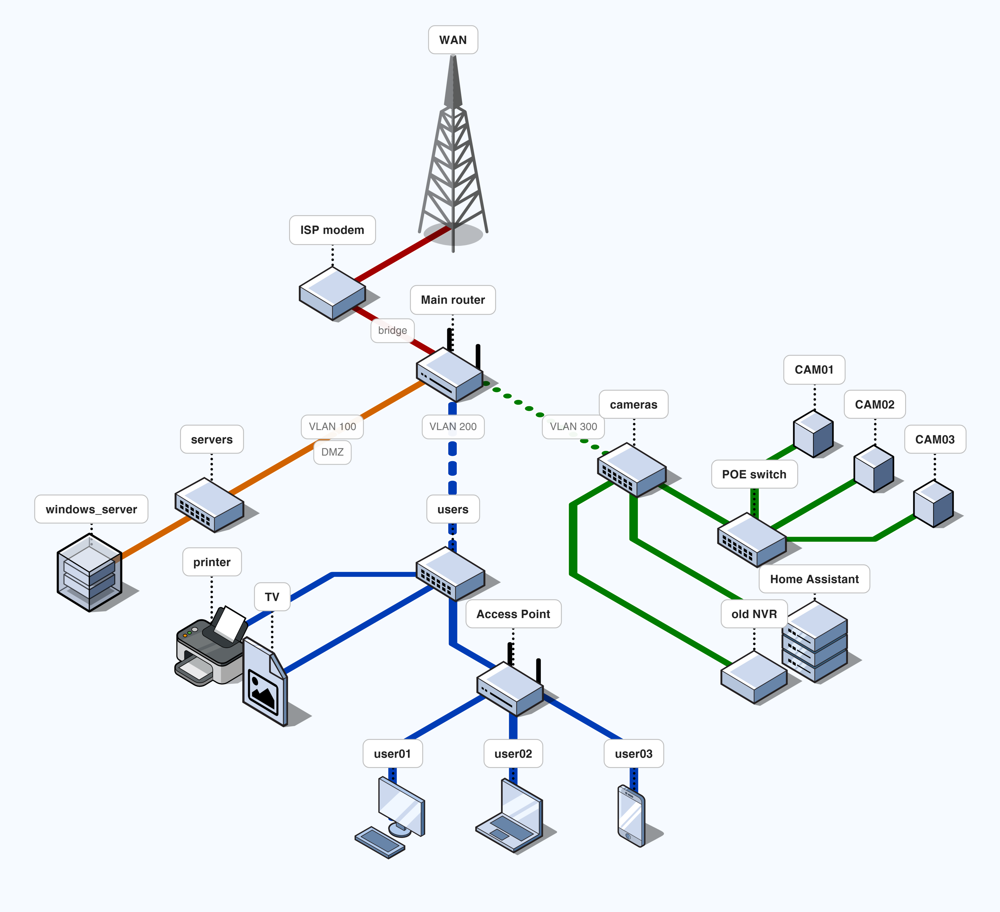
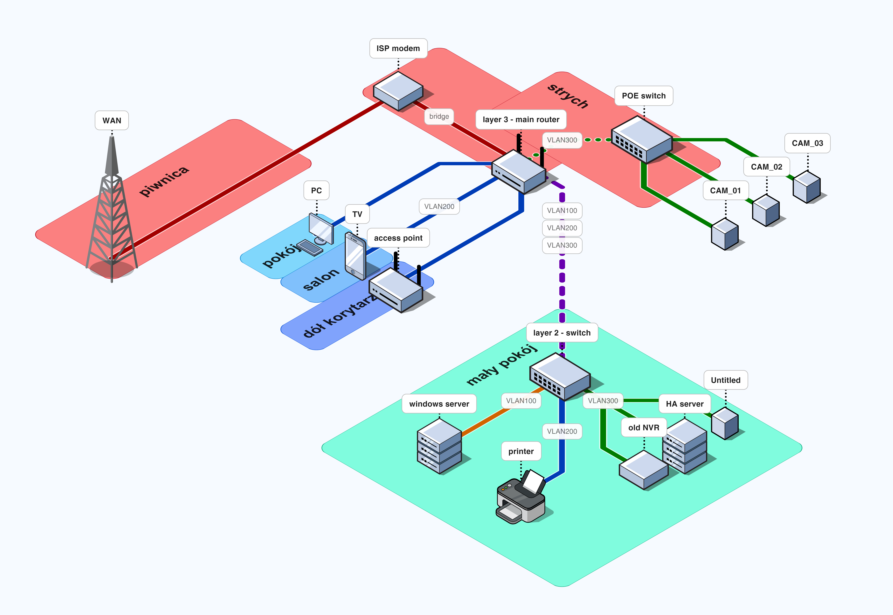

# Network Engineering Project
**nazwa:** House#1  
**opis:** Budowa profesjonalnej sieci LAN z wdrożeniem najwyżego bezpieczeństwa.  

### Zadania:  
1. Podział sieci na VLANY - kompletna izolacja windows serwera, systemu monitoringu i użytkowników.
2. Instalacja VPN - dla zdalnego, szyfrowanego dostępu do monitoringu i systemu smart home.
3. Adresacja urządzeń  
  3.1 Routing statyczny - tam gdzie to możliwe  
  3.2 DHCP "Static-Only" - w przypadku urządzeń takich jak np. kamery (połączonych z routerem przez niezarządzalny POE_switch)  

***
  
### Użyte urządzenia:
- main router - Miktorik ax3
- switch zarządzalny - Tenda TEG2208D  
- switch niezarządzalny x1
- switch POE x2

***

### Spis treści:  
1. [Schemat administracyjny](https://github.com/Matix732/network_engineering-house1#1-schemat-administracyjny-sieci) - grafika
1.1. [Konfiguracja sieci](https://github.com/Matix732/network_engineering-house1#11-konfiguracja-sieci-lan) - rozpiska
2. [Schemat urządzeń i kabli](https://github.com/Matix732/network_engineering-house1#2-schamat-roz%C5%82o%C5%BCenia-sieci-i-urz%C4%85dze%C5%84) - grafika  
2.1. [Połączenia fizyczne]() - konfiguracja urządzeń  

***

## 1. Schemat administracyjny sieci

## 1.1 Konfiguracja sieci LAN
| VLAN | network address | maska | Host IP range | default gate | IP assign | DHCP pool |
| --- | --- | --- | --- | --- | --- | --- | 
| 100 | 192.168.100.0 | 255.255.255.252, /30 | 192.168.100.0 - 192.168.100.4 | 192.168.100.1 | static | - | 
| 200 | 192.168.200.0 | 255.255.255.0, /24 | 192.168.200.0 - 192.168.200.254| 192.168.200.1 | static + DHCP | .100 - .254 |
| 300 | 192.168.300.0 | 255.255.255.224, /27| 192.168.300.0 - 192.168.300.31 |192.168.300.1 | static | - | 

## 2. Schamat rozłożenia sieci i urządzeń

## 2.1. Połączenia fizyczne

**Mikrotik**
| interfejs | VLAN | adres | urządzenie | 
| --- | --- | --- | --- | 
| ether1 | -   | 192.168.0.1 | ISP modem | 
| ether2 | 200 | 192.168.200.2 | Access Point | 
| ether3 | 200 | DHCP | dumb_switch* | 
| ether4 | 300 | 192.168.300.2 - .31 | POE_switch* |

*1) "dumb_switch" służy za rozszerzenie liczby portów routera, podłączymy tam urządzenia niewymagające konfiguracji IP.  
*2) POE_switch należy również do urządzeń "dumb", jedynie zasili kamery i połączy je z siecią. Kamery 

